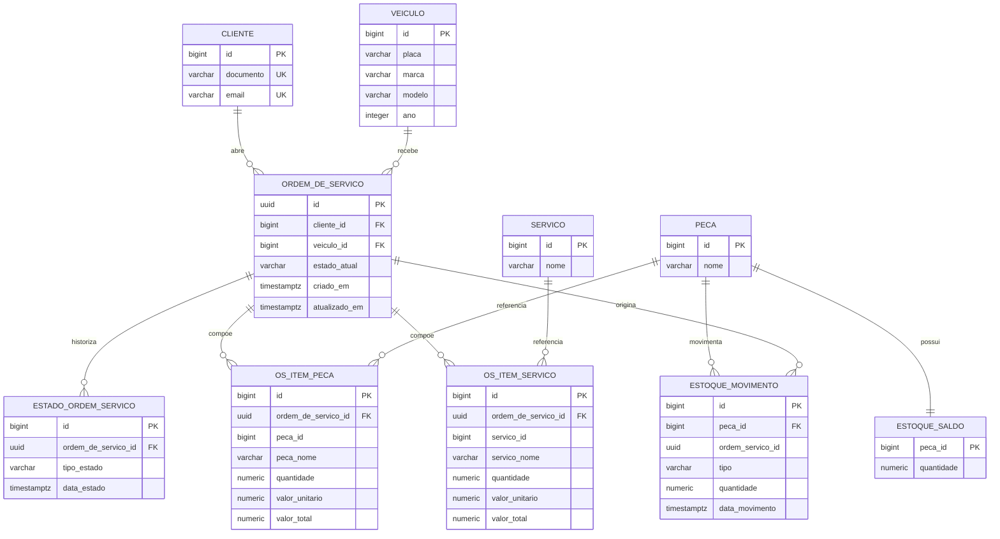
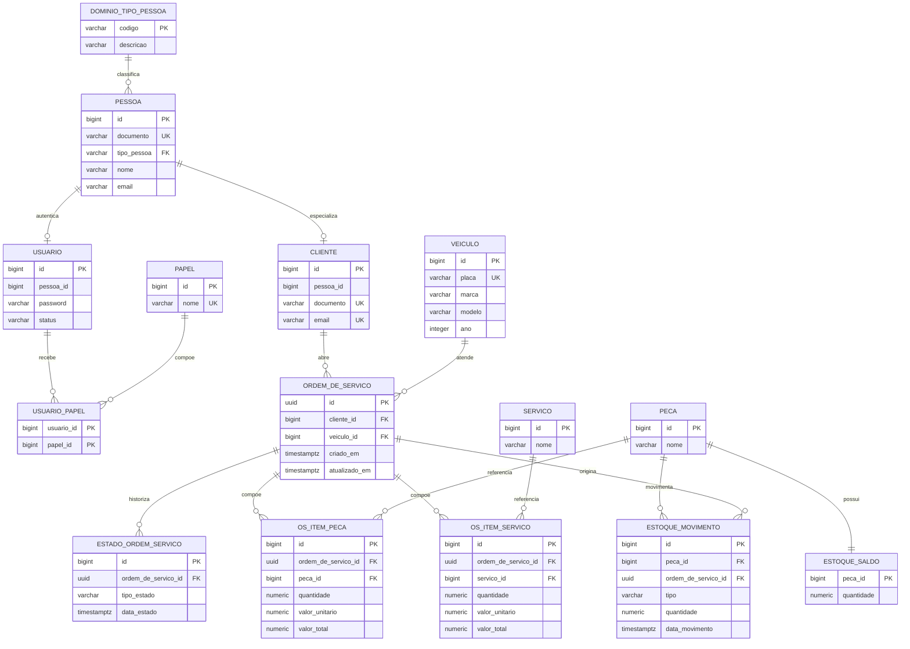

# Justificativa Formal da Escolha do Banco de Dados e dos Ajustes no Modelo Relacional

## 1. Objetivo

Este documento formaliza a justificativa para a adoção de banco de dados relacional na solução da Oficina e descreve a evolução do modelo de dados a partir da `V1__create_app_schema.sql`, com ênfase nos ajustes consolidados pela `V4__link_cliente_to_pessoa.sql`.

O objetivo central das migrations analisadas foi atender a dois requisitos simultâneos:

1. sustentar com consistência transacional o domínio operacional da oficina;
2. evoluir o schema para reduzir redundância e permitir o compartilhamento controlado da identidade entre atendimento e autenticação.

## 2. Justificativa da Escolha do Banco de Dados

A escolha por PostgreSQL em Amazon RDS é tecnicamente adequada ao domínio por cinco razões principais.

### 2.1. Forte aderência ao domínio transacional

O sistema manipula entidades com dependência forte entre si, como clientes, veículos, ordens de serviço, itens, histórico de estados, estoque, usuários e papéis. Esse conjunto exige:

- consistência entre múltiplas tabelas na mesma transação;
- preservação de integridade referencial;
- consultas com `JOIN`, filtros e ordenações por relacionamentos;
- controle explícito de histórico e rastreabilidade operacional.

Esse perfil é característico de um problema relacional, não de um cenário orientado a documentos ou chave-valor.

### 2.2. Integridade referencial nativa

As migrations usam chaves primárias, chaves estrangeiras, `UNIQUE`, `CHECK`, índices e tabelas de domínio para impedir estados inválidos no nível do banco. Essa abordagem reduz a dependência exclusiva da validação em aplicação e protege o dado mesmo em integrações paralelas, scripts operacionais ou cargas executadas fora do serviço principal.

### 2.3. Suporte a evolução incremental do schema

O projeto usa Flyway com migrations versionadas. PostgreSQL oferece suporte robusto a:

- mudanças incrementais de schema;
- backfill de dados em SQL;
- funções e triggers para compatibilidade transitória;
- constraints adicionais sem redesenho da base.

Isso é importante porque o banco é compartilhado entre aplicação e lambda, e o rollout precisa seguir estratégia de expansão, transição e contração.

### 2.4. Adequação técnica dos tipos e recursos do PostgreSQL

O modelo faz uso de recursos que são naturais em PostgreSQL:

- `uuid` para identificação de ordem de serviço;
- `timestamp with time zone` para rastreabilidade temporal;
- `numeric` para quantidades e valores monetários;
- `plpgsql` para funções de apoio e sincronização;
- índices compostos para consultas por histórico e associação.

Essa combinação favorece precisão, auditabilidade e previsibilidade do comportamento.

### 2.5. Compatibilidade operacional com a stack do projeto

A escolha também é coerente com a operação já definida no repositório:

- provisionamento por Terraform;
- execução gerenciada em Amazon RDS;
- migrations por Flyway;
- scripts de bootstrap, importação e publicação de secrets;
- integração com aplicação Quarkus e lambda de autenticação.

Portanto, a decisão pelo PostgreSQL não atende apenas ao modelo conceitual, mas também ao modelo operacional da solução.

## 3. Leitura do Modelo Inicial da V1

A `V1__create_app_schema.sql` estabelece a baseline do domínio de atendimento e estoque. O desenho original já demonstra escolha correta por modelagem relacional, porque separa claramente os agregados operacionais e explicita relações por identificadores estáveis.

### 3.1. Entidades centrais da V1

- `cliente`: dados básicos do cliente, com unicidade de documento e e-mail;
- `veiculo`: bem atendido pela oficina;
- `ordem_de_servico`: entidade transacional principal do atendimento;
- `estado_ordem_servico`: histórico de evolução da ordem;
- `os_item_peca` e `os_item_servico`: composição econômica e operacional da ordem;
- `peca` e `servico`: catálogos;
- `estoque_saldo` e `estoque_movimento`: controle de inventário.

### 3.2. Diagrama ER da V1

### 3.3. Avaliação do modelo da V1

O modelo da V1 é adequado para um primeiro recorte funcional porque:

- separa cadastro, atendimento e estoque;
- preserva histórico de estado em tabela própria;
- permite composição da ordem com múltiplos itens;
- viabiliza controle de estoque associado ou não a uma ordem.

Ainda assim, ele carrega limitações estruturais que ficam evidentes quando o domínio passa a compartilhar identidade com a camada de autenticação.

As principais limitações são:

- `cliente` guarda identidade própria sem reutilização explícita por outros subdomínios;
- não existe vínculo formal entre `cliente` e `pessoa`;
- `usuario` e `pessoa`, introduzidos depois, tenderiam a repetir dados já presentes em `cliente`;
- o modelo de identidade ficaria fragmentado entre atendimento e autenticação.

Em outras palavras, a V1 é consistente para o domínio de atendimento isolado, mas não é o melhor formato para um ecossistema com autenticação e múltiplos perfis ligados à mesma pessoa.

## 4. Justificativa dos Ajustes Introduzidos até a V4

A `V4__link_cliente_to_pessoa.sql` consolida a principal evolução conceitual do modelo: a separação entre identidade civil e papel de negócio.

Na prática, a migration transforma `pessoa` na entidade canônica de identidade e reposiciona `cliente` como uma especialização dessa pessoa no contexto de atendimento.

### 4.1. Problema endereçado

Antes do ajuste, o domínio possuía duas linhas de representação potencialmente concorrentes:

- `cliente`, com `documento` e `email`;
- `pessoa`, criada para sustentar autenticação e associação com `usuario`.

Sem um vínculo formal entre elas, surgem riscos objetivos:

- duplicidade cadastral;
- divergência entre documento/e-mail em tabelas diferentes;
- dificuldade para compartilhar identidade entre aplicação e lambda;
- aumento do custo de manutenção de regras de negócio e integrações.

### 4.2. Decisão de modelagem

A decisão adotada foi:

1. manter `pessoa` como entidade base de identidade;
2. classificar a identidade com `tipo_pessoa`;
3. vincular `cliente` a `pessoa` por relação `1:1`;
4. preservar temporariamente `documento` e `email` em `cliente` para compatibilidade;
5. usar trigger de sincronização durante a transição.

Essa solução é mais correta do que manter dois cadastros independentes, porque separa:

- o que a pessoa "e" do ponto de vista cadastral (`pessoa`);
- o papel que ela exerce em um processo específico (`cliente`);
- o vínculo dela com autenticação (`usuario`);
- o conjunto de autorizações (`papel` e `usuario_papel`).

### 4.3. Ajustes estruturais relevantes da V4

Os principais ajustes aplicados são:

- criação de `dominio_tipo_pessoa`;
- inclusão de `tipo_pessoa`, `nome` e `email` em `pessoa`;
- inclusão de `pessoa_id` em `cliente`;
- backfill de `pessoa` a partir de `cliente`;
- preenchimento obrigatório de `cliente.pessoa_id`;
- criação de `UNIQUE (pessoa_id)` em `cliente`, consolidando cardinalidade `1:1`;
- criação de `FOREIGN KEY cliente.pessoa_id -> pessoa.id`;
- validação para impedir `usuario` ligado a pessoa jurídica;
- trigger `trg_cliente_sync_pessoa` para sincronização transitória.

## 5. Diagrama ER do Modelo Ajustado

O diagrama abaixo resume o modelo relacional relevante após os ajustes da V4, considerando a base criada na V1 e as estruturas de identidade e autenticação incorporadas nas migrations seguintes.

## 6. Explicação dos Relacionamentos

### 6.1. `pessoa` -> `cliente` (`1:1`)

Cada `cliente` deve estar vinculado a exatamente uma `pessoa`, e cada `pessoa` pode representar no máximo um `cliente` no modelo atual. Essa cardinalidade é imposta por:

- `cliente.pessoa_id NOT NULL`;
- `FOREIGN KEY` para `pessoa(id)`;
- `UNIQUE (pessoa_id)`.

Essa escolha elimina a duplicidade conceitual de identidade e permite que o cliente seja tratado como papel de negócio, não como cadastro raiz isolado.

### 6.2. `pessoa` -> `usuario` (`1:0..1`)

Uma `pessoa` pode ou não possuir um `usuario`. Quando existe, o vínculo é único. Isso permite distinguir:

- pessoas cadastradas apenas para atendimento;
- pessoas com acesso autenticado ao sistema.

Além disso, a V4 valida que `usuario` só pode estar associado a pessoa física, preservando coerência com o processo de autenticação individual.

### 6.3. `usuario` <-> `papel` (`N:N`)

O relacionamento é materializado por `usuario_papel`. Essa estrutura é adequada porque um usuário pode exercer múltiplos papéis, e o mesmo papel pode ser atribuído a múltiplos usuários. Trata-se de um caso clássico de associação muitos-para-muitos.

### 6.4. `cliente` -> `ordem_de_servico` (`1:N`)

Um cliente pode abrir várias ordens ao longo do tempo, enquanto cada ordem pertence a um único cliente. Esse relacionamento preserva rastreabilidade de atendimento e histórico operacional por titular.

### 6.5. `veiculo` -> `ordem_de_servico` (`1:N`)

Um veículo pode passar por várias ordens de serviço em momentos distintos, mas cada ordem referencia um único veículo. Isso permite histórico técnico por placa, modelo e ano.

### 6.6. `ordem_de_servico` -> `estado_ordem_servico` (`1:N`)

Esse relacionamento registra a evolução temporal do atendimento. A decisão de manter tabela própria para estados é superior a um único campo sobrescrito quando há necessidade de:

- auditoria;
- acompanhamento do fluxo;
- reconstrução do estado mais recente;
- emissão de notificações por transição.

### 6.7. `ordem_de_servico` -> `os_item_peca` e `os_item_servico` (`1:N`)

Uma ordem pode conter vários itens de peça e vários itens de serviço. A separação em tabelas distintas mantém clareza semântica entre consumo de material e execução de serviço, além de facilitar cálculo, agregação e integração com estoque.

### 6.8. `peca` -> `estoque_saldo` (`1:1`) e `peca` -> `estoque_movimento` (`1:N`)

Cada peça possui um saldo consolidado e diversos movimentos ao longo do tempo. O saldo atende leitura rápida; o movimento atende rastreabilidade e auditoria. Essa combinação é típica e adequada em controle de inventário.

### 6.9. `ordem_de_servico` -> `estoque_movimento` (`1:0..N`)

Nem todo movimento de estoque nasce de uma ordem, mas uma ordem pode originar vários movimentos. Isso atende tanto consumo operacional quanto ajustes independentes de atendimento.

## 7. Fundamentação dos Ajustes no Modelo Relacional

Os ajustes realizados até a V4 se justificam formalmente por quatro ganhos principais.

### 7.1. Normalização da identidade

Ao mover a identidade canônica para `pessoa`, o modelo reduz redundância lógica e cria um ponto único para documento, classificação e dados cadastrais compartilhados.

### 7.2. Reuso entre subdomínios

O mesmo registro de `pessoa` passa a sustentar:

- atendimento, via `cliente`;
- autenticação, via `usuario`;
- autorização, via `usuario_papel`.

Esse reuso diminui divergência entre serviços e melhora a consistência entre aplicação e lambda.

### 7.3. Integridade progressiva com compatibilidade

A V4 não foi desenhada como corte abrupto. Ela faz backfill, valida pré-condições, cria vínculos formais e mantém sincronização transitória. Isso é tecnicamente relevante porque o banco é compartilhado por múltiplos consumidores e a migração precisava preservar continuidade operacional.

### 7.4. Preparação para evolução futura

Com `pessoa` como raiz de identidade, o modelo fica mais preparado para novos perfis de negócio, como representantes, operadores ou responsáveis legais, sem exigir nova duplicação estrutural de documento e e-mail.

## 8. Conclusão

A escolha por PostgreSQL foi correta porque o problema tratado é essencialmente relacional, transacional e dependente de integridade forte. A `V1` já refletia esse acerto ao estruturar atendimento, composição de ordens e estoque em entidades relacionadas.

Os ajustes consolidados pela `V4` representam uma evolução necessária do modelo. Eles mantêm a base operacional da V1, mas introduzem uma camada de identidade mais consistente, reutilizável e alinhada à autenticação. Com isso, o banco passa a refletir melhor o domínio real da solução: uma mesma pessoa pode participar do sistema em papéis distintos, e esses papéis precisam coexistir sem duplicidade cadastral nem perda de integridade.
