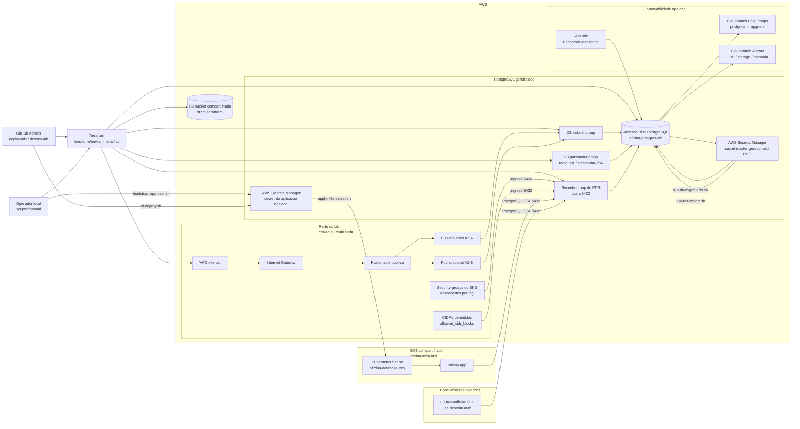

# oficina-db-infra

Infraestrutura AWS/Terraform da base PostgreSQL da Oficina.

O repositório foi alinhado com `oficina-infra-k8s` para usar os mesmos nomes de infra compartilhada do laboratório e a mesma família de GitHub Actions, mas continua independente:

- se a infra compartilhada do lab já existir, este projeto a reutiliza
- se ela não existir, este projeto cria o que precisa para o banco subir
- recursos compartilhados fora do state deste repo não são recriados nem destruídos

## O que este projeto gerencia

- Amazon RDS PostgreSQL
- security group, subnet group e parameter group do banco
- VPC/subnets do lab quando a rede compartilhada ainda não existir
- bucket S3 compartilhado do Terraform quando ele precisar ser criado por este state

## Diagrama de serviços



## Convenções padronizadas com o repo k8s

- nome padrão da infra compartilhada: `eks-lab`
- bucket compartilhado: `tf-shared-<shared_infra_name>-<account-id>-<region>`
- chave default do state deste repo: `oficina/lab/database/terraform.tfstate`
- cluster EKS compartilhado esperado: `eks-lab`
- banco padrão: `oficina-postgres-lab`

## Estrutura

- `terraform/modules/network`: mesma convenção de rede do repo `oficina-infra-k8s`
- `terraform/modules/terraform_shared_data_bucket`: mesmo módulo de bucket compartilhado do repo `oficina-infra-k8s`
- `terraform/modules/rds-postgres`: módulo do banco
- `terraform/environments/lab`: root module do ambiente
- `scripts/actions/ci-terraform.sh`: apply/destroy com bootstrap e reuso do backend remoto
- `scripts/actions/ci-deploy.sh`: apply do Terraform, bootstrap opcional do usuário da aplicação, migrations Flyway e secret no cluster
- `scripts/manual/run-db-migrations.sh`: executa as migrations Flyway em `sql/migrations`
- `scripts/actions/cleanup-orphan-db.sh`: cleanup para recursos órfãos sem state remoto; remove resíduos do banco e preserva recursos compartilhados ainda em uso

## Comportamento de reuso e criação

O root module resolve a infraestrutura nesta ordem:

1. usa `vpc_id` e `subnet_ids` explícitos, se informados
2. tenta reutilizar a VPC nomeada como `<shared_infra_name>-vpc`
3. se não encontrar a VPC e `create_network_if_missing=true`, cria uma rede nova com os mesmos nomes usados no repo k8s

Para acesso do EKS ao banco, o projeto tenta reutilizar security groups tagueados com `aws:eks:cluster-name=<eks_cluster_name>`. Se eles não existirem, informe `allowed_security_group_ids` ou `allowed_cidr_blocks`.

## Configuração local

Use o exemplo de variáveis:

```bash
cp terraform/environments/lab/terraform.tfvars.example terraform/environments/lab/terraform.tfvars
```

Campos principais:

- `shared_infra_name`: prefixo da infra compartilhada. Default `eks-lab`
- `eks_cluster_name`: nome do cluster EKS compartilhado. Default `eks-lab`
- `db_identifier`: default `oficina-postgres-lab`
- `create_network_if_missing`: cria a rede do lab se ela ainda não existir
- `vpc_id` e `subnet_ids`: forçam uso de rede específica
- `allowed_security_group_ids` e `allowed_cidr_blocks`: controlam quem acessa a porta `5432`
- `create_terraform_shared_data_bucket`: só deve ficar `true` quando este state for gerenciar o bucket compartilhado

## State do Terraform

Local:

```bash
terraform -chdir=terraform/environments/lab init
```

Remoto em S3:

```bash
cp terraform/environments/lab/backend.s3.tf.example terraform/environments/lab/backend.tf
cp terraform/environments/lab/backend.hcl.example terraform/environments/lab/backend.hcl
terraform -chdir=terraform/environments/lab init -reconfigure -backend-config=backend.hcl
```

Nos workflows do GitHub Actions, o script `scripts/actions/ci-terraform.sh` faz bootstrap local do bucket quando necessário, migra o state para S3 e reutiliza o bucket compartilhado quando ele já existir.

Quando o state remoto ainda não existe, mas resíduos nomeados do banco já existem, o workflow executa automaticamente um cleanup limitado ao banco antes do `apply`. Esse cleanup não remove VPC, subnets, route tables, internet gateway ou bucket compartilhado.

## Apply

```bash
terraform -chdir=terraform/environments/lab plan -var-file=terraform.tfvars
terraform -chdir=terraform/environments/lab apply -var-file=terraform.tfvars
```

## Destroy seguro

O baseline mantém `deletion_protection = true`.

Para destroy manual:

```bash
terraform -chdir=terraform/environments/lab destroy \
  -var-file=terraform.tfvars \
  -var='deletion_protection=false'
```

Nos GitHub Actions, o destroy faz verificações extras antes de continuar:

- bloqueia se subnet group ou security group do banco ainda estiverem em uso por outros RDS
- bloqueia se a VPC gerenciada por este repo ainda estiver em uso por clusters EKS, outros RDS ou ENIs externos ao banco
- bloqueia se o bucket compartilhado tiver objetos fora do state deste projeto

## GitHub Actions

Workflows disponíveis:

- `.github/workflows/deploy-lab.yml`
- `.github/workflows/destroy-lab.yml`

Todos usam o GitHub Environment `lab` e um grupo de `concurrency` próprio do banco, mantendo a mesma organização do repo `oficina-infra-k8s` sem acoplar a execução entre repositórios.

Detalhes de variáveis e secrets: [docs/github-actions.md](docs/github-actions.md)

## Operações opcionais

Bootstrap do usuário da aplicação:

```bash
STORE_IN_SECRETS_MANAGER=true \
APP_SECRET_NAME="oficina/lab/database/app" \
./scripts/manual/bootstrap-app-user.sh
```

Migrations do schema:

```bash
./scripts/manual/run-db-migrations.sh migrate
```

O script usa o secret master do RDS exposto pelo Terraform quando `DB_SECRET_ARN` não é informado. Em CI ele usa a imagem Docker `redgate/flyway:12.4-alpine` quando o binário `flyway` não estiver instalado.

As migrations ficam em `sql/migrations`. A `V1__create_app_schema.sql` é a baseline das entidades JPA do `oficina-app`; a `V2__create_auth_schema.sql` cria as tabelas de autenticação usadas pelo lambda.

No `Deploy Lab`, o seed `sql/import.sql` roda depois das migrations quando `RUN_DB_IMPORT=true` (default). Ele usa upserts para poder ser reexecutado no ambiente lab.

Publicação do secret no cluster:

```bash
DB_SECRET_ARN="oficina/lab/database/app" \
EKS_CLUSTER_NAME="eks-lab" \
UPDATE_KUBECONFIG=true \
./scripts/manual/apply-k8s-secret.sh
```

O secret Kubernetes gerado usa `DB_SSLMODE=require` por padrão e publica a URL reativa do Quarkus com `sslmode=require`, compatível com o `rds.force_ssl=1` configurado no RDS.

Carga inicial:

```bash
./scripts/manual/run-db-migrations.sh migrate

DB_SECRET_ARN="oficina/lab/database/app" \
IMPORT_FILE="sql/import.sql" \
./scripts/manual/run-rds-import.sh
```

`sql/import.sql` é seed de laboratório, não migration. Ele assume que o Flyway já criou as tabelas.

## Validação local

```bash
terraform fmt -check -recursive terraform
terraform -chdir=terraform/environments/lab validate
find scripts -type f -name '*.sh' -print0 | xargs -0 bash -n
```
